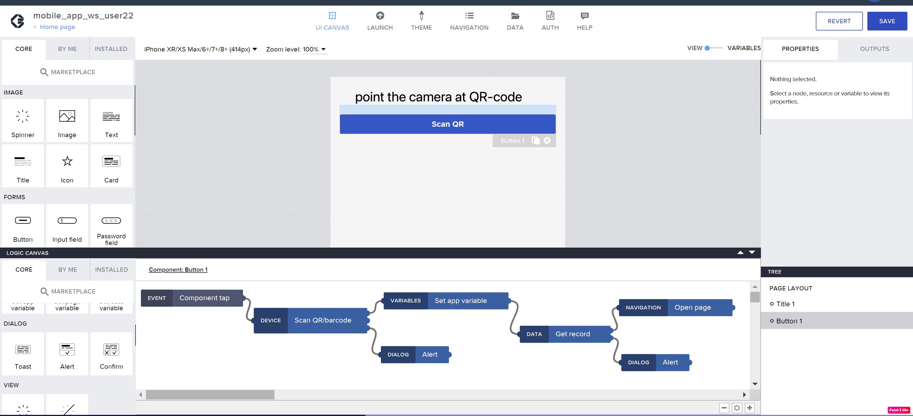

# Step 0 «Enter SAP Build Lobby»

Open <https://samruktest-gdpazdel.eu10.build.cloud.sap/lobby>\
Authentificate using <https://a8nbw3y7x.accounts.ondemand.com/>
(only if the authentification is requested)

Enter your user and password

# Step 1 «Creating an Application Project in SAP Build apps Lobby»: 

Create your application project by clicking on **Create**.\

Choose **Build an Application**.\
\

Next, select **Web & Mobile Application**\

For the *Project Name*, specify a name based on your user, such as **mob_app_ws_user(?),** add a comment in the description, and then click **Create** to initiate working on your application.\
\

# Step 2 «Opening the Project, Home Page»: 

Upon completing Step 1, you will be redirected to the Build Apps Composer editor, which serves as a kind of IDE (Integrated Development Environment) for SAP Build Apps. On the canvas, you can already see the initial **Home page** of your application with fields for the title and text:\

On the left, you will find elements that can be added to the canvas. On the right, there is a properties panel for the selected element, and at the bottom right, you will find the structure of elements on the canvas. Below, there is a panel for adding logic to the elements.

In summary, building your application involves:

\- Defining connections to data sources and application variables.

\- Designing UI elements.

\- Implementing logic for the selected elements.

# Step 3 "Application Architecture: Data Connectivity":

In this step, we will focus on connecting our application to data sources. Follow the instructions below:

1. Navigate to the **DATA** tab:
   

2. In the SAP Build Apps classic data entities section, create definitions for two API calls of type OData Integration:

   - One API call is for retrieving data about a request by its UUID, which is read from a QR code.
   
   - The other API call is for uploading an image to the Blob table using the UUID from a QR code.

   To create these API calls, select the **OData Integration** type:
   

3. Insert the link to the description of our API services (\$metadata) from the API server:

   https://afanasevdm-cfruntime-371tohiy-dev-dbapi-fiori-srv.cfapps.us10.hana.ondemand.com/service/catalog/$metadata
   
   Then click **Verify URL**:
   

4. The configurator, using the metadata information, has identified 2 entities: **Request** and **Blobstorage**. Activate both of them:
   

5. For these entities, settings for standard access methods (GET, POST, UPDATE, etc.) will appear. Save the configurations by clicking **SAVE DATA RESOURCES**:
   

6. As a result, the project will now have access methods defined for the 2 API server entities: **Request** (a table of requests) and **Blobstorage** (a table of blob objects with UUIDs from requests).

   The outcome should look like this:
   

# Step 3 «Building the app: connecting to Data»: 

Пройдем во вкладку **DATA**:

Далее в секции SAP Build Apps classic data entities создадим определение
2х API вызовов типа OData Integration.

\- Один - API вызов для получения данных о заявке на проход по UUID,
считанного из QR кода.

\- Второй - API вызов для загрузки изображения в Blob таблицу по UUID,
считанного из QR кода.

Для этого выберем **OData Integration** тип:

Вставим ссылку описания наших API сервисов (\$metadata) от сервера API:

<https://afanasevdm-cfruntime-371tohiy-dev-dbapi-fiori-srv.cfapps.us10.hana.ondemand.com/service/catalog/$metadata>

нажмем **Verify URL**:

Конфигуратор по описанию metadata информации распознал 2 сущности:
**Request, Blobstorage**, активируем обе:

Для сущностей появляются элементы настройки стандартных методов доступа
к ним (GET, POST, UPDATE и т.д.). Сохраняем конфигурации нажатием SAVE
DATA RESOURCES:

В результате у нас появились в проекте описанные методы доступа к 2
сущностям API сервера: Request (таблица заявок) и Blobstorage (таблица
blob объектов c UUID заявки).

Результат:

# Шаг 4 «Архитектура приложения: создание страниц приложения»:

Согласно архитектуре приложения, нужно создать 2 страницы приложения
«Home Page» и "Photo Page". Для этого кликните по ссылке "Home Page":

Откроется конфигуратор, где необходимо добавить вторую страницу, кликнув
на **ADD NEW PAGE**:

В открывшемся окне введите название страницы «**Photо page**», далее
**OK**:

В результате откроется вновь созданная страница, нажмите SAVE:

# Шаг 5 «Архитектура приложения: добавление элементов первой странички»:

Переходим на первую страницу приложения, кликнув **Home page** по
навигационной ссылке и потом по самой страничке **Home page**: (может
потребоваться нажать SAVE, если предыдущие изменения не были сохранены)

Выберите *Headerline* и измените текст на следующий «***Наведите на QR
код заявки в приложении***»:

В **LAYOUT** вкладке свойств в разделе **LAYOUT** выберите выравнивание
по центру:

и удалите второй **Text 1** элемент:

Добавьте элемент **Button** на канву первой странички из библиотеки
элементов слева, вкладка **CORE**. поменяйте название кнопки на ***"Scan
QR"***:

# Шаг 6 «Архитектура приложения: добавление логики первой странички»:

Определим переменную **uuid_var** уровня App Variable с типом *"**any
text**"*, куда будет считан UUID заявки, переключив **VIEW --
VARIABLES**:

Сохраним изменения через **SAVE**

Перейдем на первую страницу приложения "**Home page**", переключив
**VIEW -- VARIABLES**.

Выберем кнопку **Scan QR**, откроем панель **Add logic to "Button 1"**
внизу экрана:

и разместим в открывшейся панели следующие элементы с панели **Logic
CORE** слева:

#### Device: Scan QR/barcode

#### Variables: Set app variable

#### Data: Get Record

#### Navigation: Open page

#### Dialog: Alert

#### Dialog: Alert

И соединим их как показано на рисунке:

В логическом блоке **Variables: Set app variable** присвоим переменной
**uuid_var** уровня App Variable считанное и дешифрованное значение из
блока **Scan QR/barcode** привязав значение переменной в поле **Variable
name**:

И присвоив значение вывода предыдущего блока, кликнув на иконку под
**Assigned value** и выбрав **Output value of another node**:

Далее выбрать **Scan QR/barcode** у Select logic node, **Scan QR/barcode
/ QR barcode content** у Select node output, далее кнопка **SAVE**:

Для чтения данных по заявке методом **Get record** используя
дешифрованное значение UUID, хранящееся в переменной **uuid_var**,
заполняем параметры блока следующим образом:

\- API вызов из ресурса **Request**:

Id параметр заполняется переменной:

Далее **App Variables**, дальше выбираем переменную **uuid_var** и жмем
**SAVE**:

Для первого элемента **Alert** задаем текст «**cannot read QR**» вывода
при неудачном чтении QR кода:

Для второго **Alert** аналогично задаем сообщение неуспешного чтения из
API -- "**request not found**":

Сохраняем все изменения в проекте через кнопку SAVE:

# Шаг 7 «Архитектура приложения: добавление переменных и элементов второй странички»:

Переходим на страницу Photo page:

Переключитесь в режим **VARIABLES** и добавьте 2 переменные **name** и
**surname** как параметры страницы на вкладке **PAGE PARAMETERS**:

Перейдите на вкладку **PAGE VARIABLES** и создайте еще 2 переменные для
хранения сделанной фотографии с соответствующими типами данных (mimetype
-- text; photo_path -- local file system path):

Перейдите в режим VIEW и удалите **Headline** элемент. А для текстового
элемента задайте свойство Content в виде формулы со значением
**JOIN(\[\"Сделайте фото для \", params.name, params.surname\], \'
\')**:

Сохраните результат

Расположите текст по центру, поменяв свойства тестового поля как на
картинке **LAYOUT -\> Text Align -\> center**:

Далее добавьте на канву страницы **Photo page** новые элементы:

\- Image

\- Button 1

\- Button 2

И поменяйте label для кнопок как на картинке:

Для элемента Image увяжите свойство **Source** картинки с переменной
**PAGE VARIABLE: photo_path**:

Далее поменяйте размеры картинки на фиксированные:

И расположите картинку по центру:

# Шаг 8 «Архитектура приложения: добавление логики работы второй странички -- кнопка take photo»:

Выберем кнопку take a photo и откроем панель добавления логики и кликнем
на **Marketplace**:

В поле поиска напишем «covert file to base64» и выберем найденный
элемент:

Далее установим компонент нажав **INSTALL**:

После этого, элемент появится во вкладке INSTALLED:

Далее соберем следующие элементы на канве логики работы кнопки:

DEVICE: take photo

VARIABLES: set page variable

VARIABLES: set page variable

DIALOG: Alert

И свяжем как на картинке:

Один элемент присвоения переменной увяжем с **mimeType** вывода элемента
**Take photo** и переменной страницы **mimetype**:

И сохранить.

Во втором элементе настроить присвоение страничной переменной
**photo_path** с выводом блока **Take photo -- path**:

И сохранить.

Для элемента **DIALOG: Alert** задайте текст "**failed to take photo**":

Сохраните проект:

# Шаг 9 «Архитектура приложения: добавление логики работы второй странички -- кнопка upload to system»: 

Выберем кнопку Upload to system и откроем панель логики работы кнопки.
Далее добавим след элементы на панель:

\- MEDIA: Convert file to base64 (чтобы сериализовать фото в
последовательность текста и сохоанить в виде BLOB в поле таблицы в БД)

\- VIEW: Show spinner (чтобы заморозить экран на время работы конвертера
и загрузки в БД)

\- VIEW: Show spinner (чтобы разморозить экран в случ успеха или ошибки)

\- DATA: Create record (чтобы передать в API параметры картинки и
сохранить в БД)

\- DIALOG: Alert (чтобы вывести сообщения об успехе или ошибки работы
процесса)

И увяжем их соответствующим образом:

Далее для элемента **Convert file to base64** зададим след параметры:
URL файла для конверсии укажем из **PAGE VARIABLE photo_path**:

Для элемента Create Record выберем resource name: Blobstorage:

А для поля **Record** выберем «**Object with properties**» и зададим
след значения:

\- поле **mimetype** увязать с переменной **mimetype** типа **PAGE
VARIABLE**

\- поле **req_uuid** увязать с переменной **uuid_var** типа **APP
VARIABLE**

\- поле **Imagedata** увязать с выводом предыдущего элемента-конвертора
**Convert file to Base64 / Base64 text**

Для Alert успешного создание записи в БД выводим сообщение успеха -
***Uploaded***:

В случае неуспешной записи в БД выводим сообщение -- ***Failed to
Upload***:

В случае неуспешной ковертации изображения выводим сообщение --
***failed to convert***:

Сохраняем весть проект:

# Шаг 10 «Архитектура приложения: увяжем передачу параметров между страницами»: 

Откроем страницу **Home page** и выберем кнопку **Scan QR**, откроем
панель логики работы кнопки и выберем блок **NAVIGATION: Open page**. В
свойстве page (следующей открываемой страницы) укажем страницу **Photo
page**:

А требуемые параметры открываемой страницы (**PAGE PARAMETERS**
определенные для **Photo page** ранее) увяжем с возвращенным результатом
работы **API Get record** к сущности **Request**:

И сохранить.

Сохраняем весть проект:

# Шаг 11 «Запуск приложения в тестовом режиме на телефоне»:

1.  Устанавливаем приложение **SAP Build Apps** из Appstore или Google
    Store

2.  Переходим на вкладку Launch в проекте приложения, далее **OPEN
    PREVIEW PORTAL**:

3.  На моб телефоне заходим в приложение **SAP Build Apps**, выбираем
    вход через SAP Build Apps:

4.  Далее 6ти-значный код вводим на портале в браузере и жмем
    **Confirm**:

5.  Далее на мобильном приложении в списке Apps находим свой проект и
    жмем **Open**:

Приложение запускается

6.  Зайдите на портал и откройте **Reception** вкладку:

https://samruktest-gdpazdel.workzone.cfapps.eu10.hana.ondemand.com/site#workzone-home&/home

в списке найдите свою заявку, провалитесь в нее, считайте QR code на мобильном устройстве и сделайте фото

в результате фото появится на приложении ресепшеониста на портале.
