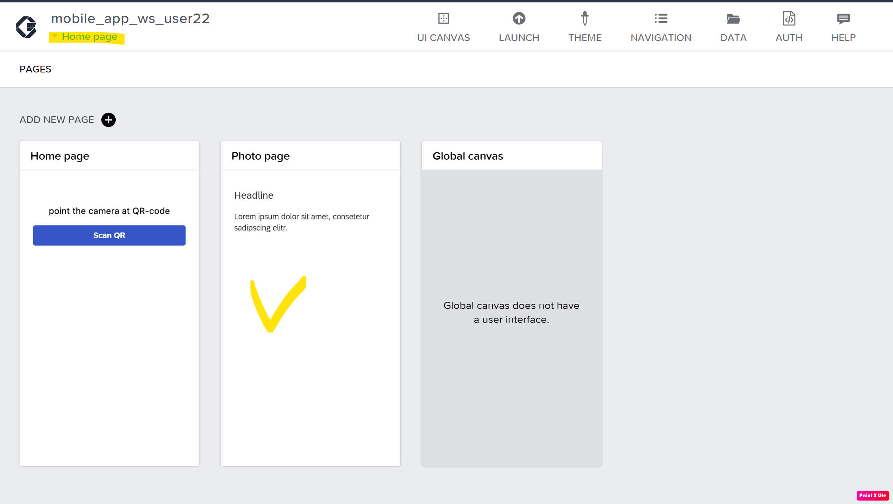

# Step 0 «Enter SAP Build Lobby»

Open <https://samruktest-gdpazdel.eu10.build.cloud.sap/lobby>\
Authentificate using <https://a8nbw3y7x.accounts.ondemand.com/>
(only if the authentification is requested)

Enter your user and password

# Step 1 «Creating an Application Project in SAP Build apps Lobby»: 

Create your application project by clicking on **Create**.\

Choose **Build an Application**.\
\

Next, select **Web & Mobile Application**\

For the *Project Name*, specify a name based on your user, such as **mobile_app_ws_user(?),** add a comment in the description, and then click **Create** to start working on your application.\
\

# Step 2 «Opening the Project, Home Page»: 

Upon completing Step 1, you will be redirected to the Build Apps Composer editor, which is a kind of IDE (Integrated Development Environment) for SAP Build Apps. On the canvas, you can already see the initial **Home page** of your application with fields for the title and text:\

On the left, you will find elements that can be added to the canvas. On the right, there is a properties panel for the selected element, and at the bottom right, you will find the tree of elements on the canvas. Below, there is a panel for adding logic to the elements.

In summary, building your application involves:

\- Defining connections to data sources and application variables.

\- Designing UI elements.

\- Implementing logic for the selected elements.

# Step 3 "Building the app: connecting to Data":

In this step, we will focus on connecting our application to data sources. Follow the instructions below:

1. Navigate to the **DATA** tab:
   

2. In the SAP Build Apps classic data entities section, create definitions for two API calls of type OData Integration:

   - One API call is for retrieving data about a request by its UUID, which is read from a QR code.
   
   - The other API call is for uploading an image to the Blob table using the UUID from a QR code.

   To create these API calls, select the **OData Integration** type:
   

3. Insert the link to the description of our API services (\$metadata) from the API server:

   https://afanasevdm-cfruntime-371tohiy-dev-dbapi-fiori-srv.cfapps.us10.hana.ondemand.com/service/catalog/$metadata

   Then click **Verify URL**:
   

4. The configurator, using the metadata information, has identified 2 entities: **Request** and **Blobstorage**. Activate both of them:
   

5. For these entities, settings for standard access methods (GET, POST, UPDATE, etc.) will appear. Save the default settigs by clicking **SAVE DATA RESOURCES**:
   

6. As a result, the project will now have defined access methods for the 2 API services: **Request** (a table of requests) and **Blobstorage** (a table of blob objects with UUIDs from requests).

   The outcome should look like this:
   

# Step 4 «Building the app: creating app pages»:

In accordance with the application architecture, we need to create two application pages: "**Home Page**" and "**Photo Page**." Follow the steps below to create these pages:

1. Click on the link labeled "**Home Page**":
   

2. The configurator will open, and you need to add the second page. Click on **ADD NEW PAGE**:
   

3. In the window that appears, enter the page name as "**Photo Page**" and then click **OK**:
   

4. The newly created page will open. Click **SAVE** to save your changes:
   

# Step 5 «Building the app: adding UI elements to the first page»:

Navigate to the first page of the application by clicking on **Home page** in the navigation link, and then on the actual "**Home page**" itself (you may need to click **SAVE** if the previous changes were not saved):

Select the *Headerline* and change the text to the following: "***Point the camera at QR-code***":

In the **LAYOUT** tab, under the **LAYOUT** section, choose center alignment:

Remove the second **Text 1** element:

Add a **Button** element to the canvas of the first page from the left-side element library under the **CORE** tab. Change the button's label to ***"Scan QR"***:

# Step 6 «Building the app: adding processing logic of the first page»:

Let's define the variable **uuid_var** as an *App Variable* with the type *"**any text**"*, where the UUID of the request will be stored. To do this, switch to **VIEW -- VARIABLES**:

Save your changes using **SAVE**.

Navigate back to the first page of the application, "**Home page**," by switching to **VIEW -- VARIABLES**.

Select the **Scan QR** button and open the **Show logic for "BUTTON 1"** panel at the bottom of the screen:

In the opened panel, add the following elements from the **Logic CORE** panel on the left:

#### Device: Scan QR/barcode

#### Variables: Set app variable

#### Data: Get Record

#### Navigation: Open page

#### Dialog: Alert

#### Dialog: Alert

Connect these elements as shown in the diagram:

In the **"Variables: Set app variable"** logic block, assign the value from the **"Scan QR/barcode"** logic block to the **uuid_var** App Variable by selecting the variable in the **Variable name** field:

Assign the output value of the previous block by clicking on the icon under **Assigned value** and selecting **Output value of another node**:

Next, choose **Scan QR/barcode** under **Select logic node**, **Scan QR/barcode / QR barcode content** under **Select node output**, and then click **SAVE**:

To read data using the **"Data: Get record"** logic block, using the decoded UUID value stored in the **uuid_var** variable, fill in the parameters of the block as follows:

Maintain **Resource Name** as follows to make an API call to **Request** resource:

The **Id** parameter is filled with the variable:

Next, under **App Variables**, choose the **uuid_var** variable and click **SAVE**:

For the first **Alert** element, set the text as "**cannot read QR**" for unsuccessful QR code reading:

Similarly, for the second **Alert**, set the message for unsuccessful reading from the API as "**request not found**":

Save all changes in the project using the **SAVE** button:

# Step 7 «Building the app: adding data variables and UI elements of the second page»:

Navigate to the "**Photo page**":

Switch to the **VARIABLES** mode and add 2 variables, **name** and **surname**, as page parameters on the **PAGE PARAMETERS** tab:

Go to the **PAGE VARIABLES** tab and create 2 more variables to store the captured photo with their respective data types (*mimetype -- text; photo_path -- local file system path*):

Switch to the VIEW mode and remove the **Headline** element.

For the text element, set the Content property as a formula with the value **JOIN(\["Take a photo for ", params.name, params.surname\], ' ')**:

Save the result:

Align the text to the center by changing the properties of the text field as shown: **LAYOUT -> Text Align -> center**:

Next, add new elements to the canvas of the "**Photo page**":

- Image

- Button 1

- Button 2

Change the *label* property for the buttons as shown in the image:

For the *Image* element, bind the **Source** property of the image to the **PAGE VARIABLE: photo_path**:

Then, set fixed dimensions for the image:

And center-align the image:

# Step 8 «Building the app: adding processing logic of the second page -- "take photo" button»:

Select the "**Take a photo**" button and open the logic panel by clicking on **Marketplace**:

In the search field, type "convert file to base64" and select the found element:

Next, install the component by clicking **INSTALL**:

Afterward, the element will appear in the **INSTALLED** tab:

Now, let's drag and drop the following elements to the logic canvas for the button's functionality:

**DEVICE: take photo**

**VARIABLES: set page variable**

**VARIABLES: set page variable**

**DIALOG: Alert**

Connect them as shown in the image:

For one variable, link it to the **mimeType** output of the **Take photo** element and the page variable **mimetype**:

Then, save your changes.

For the second variable, configure it to assign the page variable **photo_path** with the output of the **Take photo -- path** block:

Save your changes.

For the **DIALOG: Alert** element, set the text to "**failed to take photo**":

Finally, save your project:

# Step 9 «Building the app: processing logic of the second page -- "upload to system" button»: 

Select the "**Upload to system**" button and open the button's logic panel. Next, add the following elements to the panel:

- **MEDIA: Convert file to base64** (to serialize the photo into a text sequence and save it as a BLOB in the database field)
- **VIEW: Show spinner** (to freeze the screen while the converter and database upload process is running)
- **VIEW: Show spinner** (to unfreeze the screen in the case of success or error)
- **DATA: Create record** (to pass image parameters to the API and save them in the database)
- **DIALOG: Alert** (to display messages about the success or failure of the process)

Connect them as shown in the image:

Next, for the **Convert file to base64** element, set the following parameters:
Specify the file URL for conversion from **PAGE VARIABLE photo_path**:

For the Create Record element, choose the resource name: **Blobstorage**:

For the **Record** field, choose "**Object with properties**" and set the following values:

- Bind the **mimetype** field to the **mimetype** variable of type **PAGE VARIABLE**
- Bind the **req_uuid** field to the **uuid_var** variable of type **APP VARIABLE**
- Bind the **Imagedata** field to the output of the previous converter element, **Convert file to Base64 / Base64 text**

For the **Alert** element for successful record creation in the database, display a success message - ***Uploaded***:

In case of unsuccessful database entry, display a message -- ***Failed to Upload***:

For unsuccessful image conversion, display a message -- ***failed to convert***:

Save your entire project:

# Step 10 «Building the app: linking parameters' transition between the pages»: 

Open the **Home page** and select the **Scan QR** button. Open the button's logic panel and choose the **NAVIGATION: Open page** block. In the **page** property (the next opened page), specify the **Photo page**:

Then, link the required parameters of the opened page (**PAGE PARAMETERS** defined for **Photo page** earlier) to the returned result of the **API Get record** for the **Request** entity:

Save your changes.

Save your entire project:

# Step 11 «Testing the app on your device»:

1. Install the **SAP Build Apps** application from the App Store or Google Play Store.

2. Go to the Launch tab in your application project, then click **OPEN PREVIEW PORTAL**:

3. On your mobile phone, open the **SAP Build Apps** application, and choose to sign in via SAP Build Apps:

4. Enter the 6-digit code on the portal in your browser and click **Confirm**:

5. In the mobile application, find your project in the list of Apps and click **Open**:

The application will launch:

6. Access the portal and open the **Reception** tab:

[Reception Portal](https://samruktest-gdpazdel.workzone.cfapps.eu10.hana.ondemand.com/site#workzone-home&/workpages/rYR9XbhxTRa1KE6OapUqCe)

In the list, find your request, enter it, scan the QR code on your mobile device, and take a photo.

As a result, the photo will appear in the receptionist's application on the portal.

